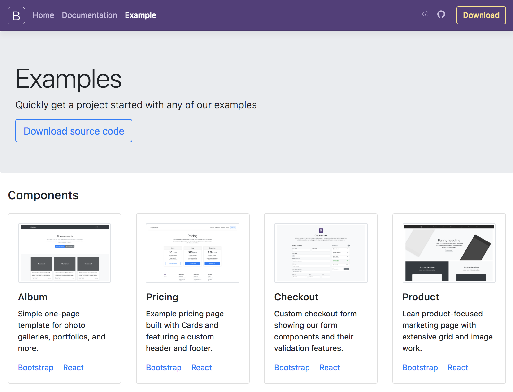

# bootstrap-4-react

[](https://opensource.org/licenses/MIT)
[](https://badge.fury.io/js/bootstrap-4-react)
[](https://www.npmjs.com/package/bootstrap-4-react)
[]()

Bootstrap 4 React components.

The goal of this library is to simplify common usages of Bootstrap 4 in React. Developers can always fall back to Bootstrap original syntaxes for advanced cases.

## Get started

```
npm install --save bootstrap-4-react
```

Then start adding components, no additional CSS/JS needed.

```
import React, { Component } from 'react';
import { Alert } from 'bootstrap-4-react';

export default class App extends Component {
  render() {
    return <Alert primary>Primary Alert</Alert>
  }
}
```

## Documentation

[Documentation](https://bootstrap-4-react.com) is built by `bootstrap-4-react` itself, check [source code](https://github.com/richardzcode/bootstrap-4-react/tree/master/site)

## Examples

Rewrite [Bootstrap examples](https://getbootstrap.com/docs/4.1/examples/) [in React](https://bootstrap-4-react.com/#example)


